# Common Source (CS) Amplifier Design & Layout

This repository contains the design, simulation, and physical layout of a Common Source (CS) Amplifier, developed using the open-source SkyWater 130nm PDK.

---

## Project Overview

This project involved extensive troubleshooting, iterative simulation, and layout optimization to help me go from theoretical hand-calculations to physical silicon realities.

All design and verification work was completed using the **IIC-OSIC-TOOLS** open-source toolchain container, utilizing:

* <u>**Xschem:**</u> Schematic capture
* <u>**Ngspice:**</u> Circuit simulation and analysis
* <u>**KLayout:**</u> Physical mask layout, as well as DRC and LVS physical verification

---

## Target Specifications & Theoretical Calculations

The initial theoretical targets for this amplifier were calculated to meet the following rigorous parameters:

* <u>**DC Gain:**</u> >= 40 dB (>= 100 V/V)
* <u>**Load Capacitance (CL):**</u> 7 pF
* <u>**Unity Gain Bandwidth (fu):**</u> 80 MHz
* <u>**Output Voltage Swing:**</u> 0.2 V to 1.6 V

Based on the standard 1.8V Sky130 transistor parameters extracted for this design (NMOS u = 301.97 cm^2/Vs, PMOS u= 24.42 cm^2/Vs, and an oxide thickness t_ox approx 4.15 nm), hand calculations dictated an initial bias current target of I_bias approx 326.55 uA and a target output resistance of R_o approx 28.42 kOhm to establish the foundational Aspect Ratios (W/L).

---
## Technology Parameters

| Parameter | nMOS | pMOS |
| :--- | :--- | :--- |
| $V_{th}$ (V) | 0.49439 | -1.0652 |
| $\mu_0$ ($\text{cm}^2/\text{V}\cdot\text{s}$) | 301.97 | 24.424 |
| $t_{ox}$ (nm) | 4.148 | 4.23 |

Where $V_{th}$ is the threshold voltage, $\mu_0$ is the carrier mobility, and $t_{ox}$ is the oxide thickness.

We also have $\epsilon_{rox} = 3.9$ and the vacuum electrical permittivity is $\epsilon_0 = 8.8541 \cdot 10^{-12} \text{ F/m}$. With that we can find $C_{ox}$:

* **For the pMOS:** $C_{ox} = \frac{\epsilon_0 \cdot \epsilon_{rox}}{t_{ox}} = 8.163 \cdot 10^{-3} \text{ F/m}^2$
* **For the nMOS:** $C_{ox} = 8.325 \cdot 10^{-3} \text{ F/m}^2$

Using `lambda_n.spice` and `lambda_p.spice`, we found:

$$ \lambda_n = 0.038052 \ \text{V}^{-1} $$
$$ \lambda_p = 0.069696 \ \text{V}^{-1} $$

---

## Math & Calculations

In order to find the output resistance that meets the frequency response requirements, we can use $f_{pole} = \frac{f_u}{A_v}$, where $f_u$ is the unity gain bandwidth. So,

$$ R_o = \frac{1}{2\pi \cdot f_{pole} \cdot C_L} = 28.421 \text{ k}\Omega $$

With this, we can find $I_{bias}$:

$$ I_{bias} = \frac{1}{(\lambda_n + \lambda_p) R_o} = 326.557 \text{ u A} $$

To satisfy the $V_{out(max)}$ of the project parameters, the drain-source voltage of M2 ($V_{DS2}$) must be $0.2\text{ V}$ ($V_{DD} - V_{out(max)}$). Thus, the aspect ratio of M2 (M3 will have the same) is:

$$ \left(\frac{W}{L}\right)_2 = \frac{2 \cdot I_{bias}}{u \cdot C_{oxp} \cdot V_{DS2}^2} = 818.923 $$

Lastly, the aspect ratio of M1 is calculated to provide the desired gain and minimum output voltage. Note that $g_{m1} = \frac{A_v}{R_o}$:

$$ \left(\frac{W}{L}\right)_1 = \frac{g_{m1}}{u \cdot C_{oxn} \cdot (V_{GS1} - V_{thn})} = 69.985 $$

---
## Troubleshooting & Final Tuned Values (DC & AC)

Theoretical square-law equations only provide a starting point in the 130nm process due to short-channel effects and massive parasitic capacitances associated with large transistor widths. Extensive troubleshooting, parameter sweeping, and operating point (`.op`) tuning were required to keep all transistors in the saturation region while pushing the bandwidth against the heavy 7 pF load.

### Final Transistor Sizing

* <u>**PMOS (Active Load, `pfet_01v8`):**</u> W = 818.923 um, L = 1 um (Implemented as nf = 10 fingers)
* <u>**NMOS (Driver, `nfet_01v8`):**</u> W = 69.985 um, L = 1 um (Implemented as nf = 5 fingers)

### Final Simulated Performance

* <u>**DC Gain:**</u> 40.62 dB
* <u>**Bandwidth:**</u> 70.90 MHz
* <u>**Bias Current / Operation Point:**</u> I_bias approx 326.56 uA at V_op = 0.767 V

*(Note: Because of extensive layout and schematic tuning, the DC Gain successfully reached the 40dB target. The bandwidth fell slightly short of the 80MHz theoretical maximum due to heavy parasitic loading inherent to the large multi-finger transistor widths required).*

---

## Transient Analysis

### Overview

Following the AC analysis—which demonstrated ~40 dB of gain and a 70.9 MHz bandwidth driving a heavy 7 pF load—the next step was to verify the time-domain behavior using a transient simulation. The goal was to observe the amplifier's real-world response to a small-signal sine wave and verify its steady-state DC equilibrium.

### Test Setup

To keep the NMOS perfectly biased on its operational cliff, the input sine wave was centered exactly at the DC Q-point derived from previous sweeps. A 5 MHz test frequency was chosen to fall well within the amplifier's 70.9 MHz bandwidth.

Input Source Configuration:
- VO = 0.767V (Q-point), VA = 1mV (Small signal), Freq = 5MHz Vin in 0 dc 0.767 ac 1 sin(0.767 1m 5Meg)

Simulation Commands (.control block): .control save all
-Run transient analysis: 1ns step size, 5us total duration tran 1n 5u
-Plot input vs. output plot v(input) v(output) .endc

## Results and Observations
1. Initial Settling Time (RC Drift) During the first microsecond of the simulation, the output voltage slowly drifted upward before stabilizing. This is a normal physical response caused by the massive 7 pF load capacitor charging up to its final DC steady-state. Because the amplifier relies on a high output resistance (R_out) to achieve its 40 dB gain, the resulting RC time constant requires a few microseconds for the output node to fully charge.

2. Phase Inversion As expected for a standard Common Source topology, the output waveform is 180 degrees out of phase with the input waveform. When the input     throttle increases, the NMOS pulls the output node down.

3. The DC Equilibrium (Input vs. Output Q-Points) Looking at the steady-state waveforms, the input and output signals center around different DC voltages:
-Input DC Baseline: ~0.767 V (Forced by the input voltage source).
-Output DC Baseline: ~779 mV (Floating).

This offset is correct and expected. In this topology, the output node is not forced to a specific voltage. Instead, its DC baseline is entirely dictated by the internal current "tug-of-war" between the PMOS current mirror (acting as an active load) and the NMOS driver. The ~779 mV output level represents the exact mathematical point where the current supplied by the PMOS matches the current sunk by the NMOS, keeping the driving transistor safely in the saturation region.

## Schematics and Layout
### Schematic:
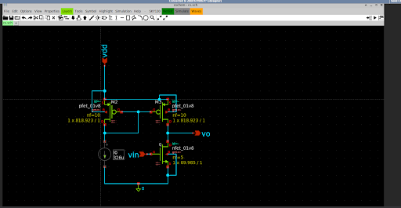

## Simulation Waveforms
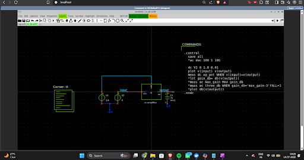

Fig 2a: DC analysis.

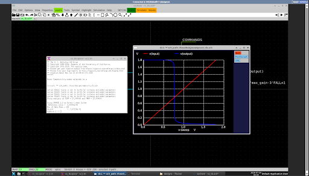

Fig 2b : DC analysis plot.

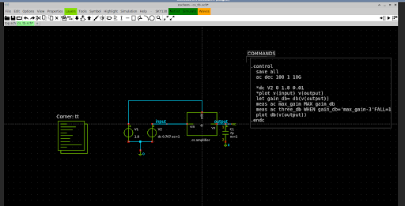

Fig 3a : Freq response code

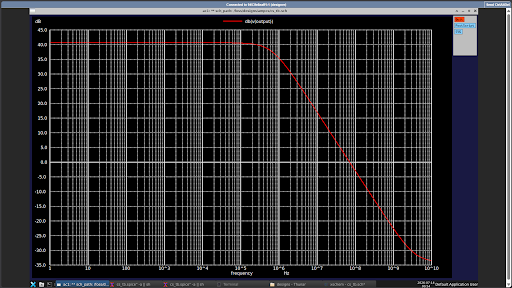

Fig 3b : Freq response plot

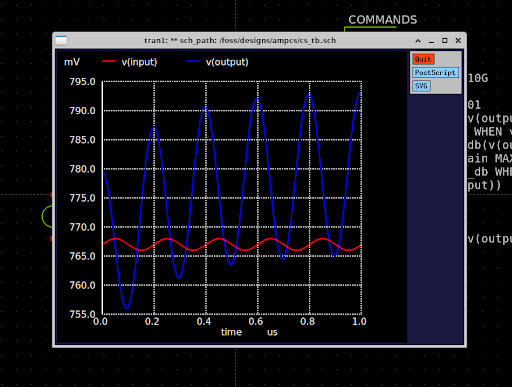

Fig 4a : Small signal plot

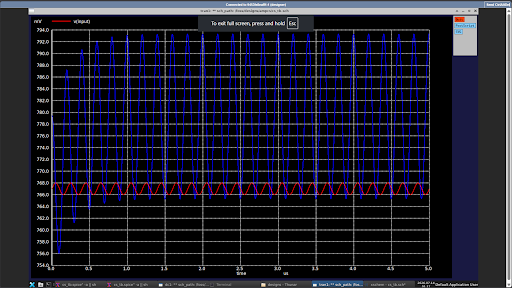

 Fig 4b : Small signal plot after some time

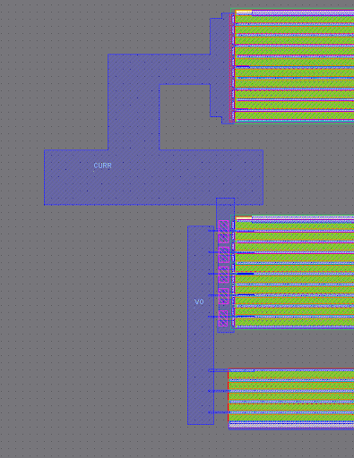
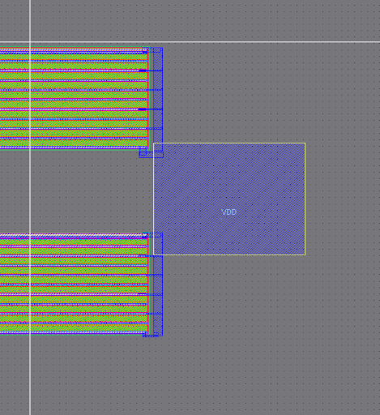
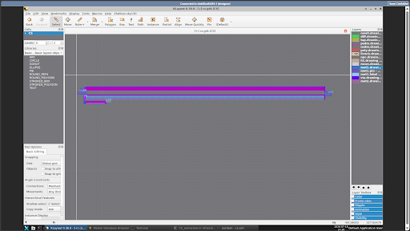

 Fig 5 a , b , c : Layout

## DRC AND LVS CHECK

### PHYSICAL LAYOUT

The physical layout was designed to handle the large transistor widths required for the high unity-gain bandwidth. It utilizes a multi-finger transistor approach to reduce parasitic gate resistance, minimize layout area, and prevent design rule violations.

### Verification & LVS Debugging

* <u>**DRC (Design Rule Check): Passed (via KLayout)**</u>
* <u>**LVS (Layout vs. Schematic): Passed (via KLayout)**</u>

Achieving a clean LVS match required significant debugging to reconcile how Xschem generates netlists versus how KLayout extracts physical parameters. The actual culprit across the debugging session was two separate issues stacking on top of each other:

1. Device Syntax (X-prefix vs M-prefix) The schematic was generating subcircuit calls, while the layout extractor was looking for native MOSFETs. This was fixed via the spiceprefix setting.

2. Multiplier (nf=) vs. Total Width The nf= (number of fingers) multiplier was not being properly understood the same way between the schematic and the extracted netlist. The extracted layout netlist does not carry an nf= property; it simply reports one lumped device with the pre-multiplied total width. To fix this, the nf= parameter was dropped in the schematic, and the total width was used instead:

 PMOS: Changed from W=818.925 nf=10 to W=8189.25
 
 NMOS: Changed from W=69.985 nf=5 to W=349.925

3. Pin Ordering The order of the variables related to M1, M2, and M3 was modified in the schematic subcircuit to exactly match the pin order generated in the CS_extracted.cir file

Generated Schematic Netlist (Original): 

.subckt cs VDD VO CURR VIN VSS M1 VO VIN VSS VSS sky130_fd_pr__nfet_01v8 L=1 W=69.985 nf=5 M2 CURR CURR VDD VDD sky130_fd_pr__pfet_01v8 L=1 W=818.925 nf=10 M3 VO CURR VDD VDD sky130_fd_pr__pfet_01v8 L=1 W=818.925 nf=10 .ends

Edited Schematic Netlist (Final LVS Match): 

.subckt CS CURR VDD VIN VO VSS M1 VO VIN VSS VSS sky130_fd_pr__nfet_01v8 L=1 W=349.925 M2 CURR CURR VDD VDD sky130_fd_pr__pfet_01v8 L=1 W=8189.25 M3 VO CURR VDD VDD sky130_fd_pr__pfet_01v8 L=1 W=8189.25 .ends CS

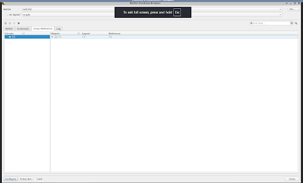

Fig 6a : LVS check

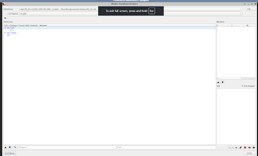

Fig 6b : DRC check
